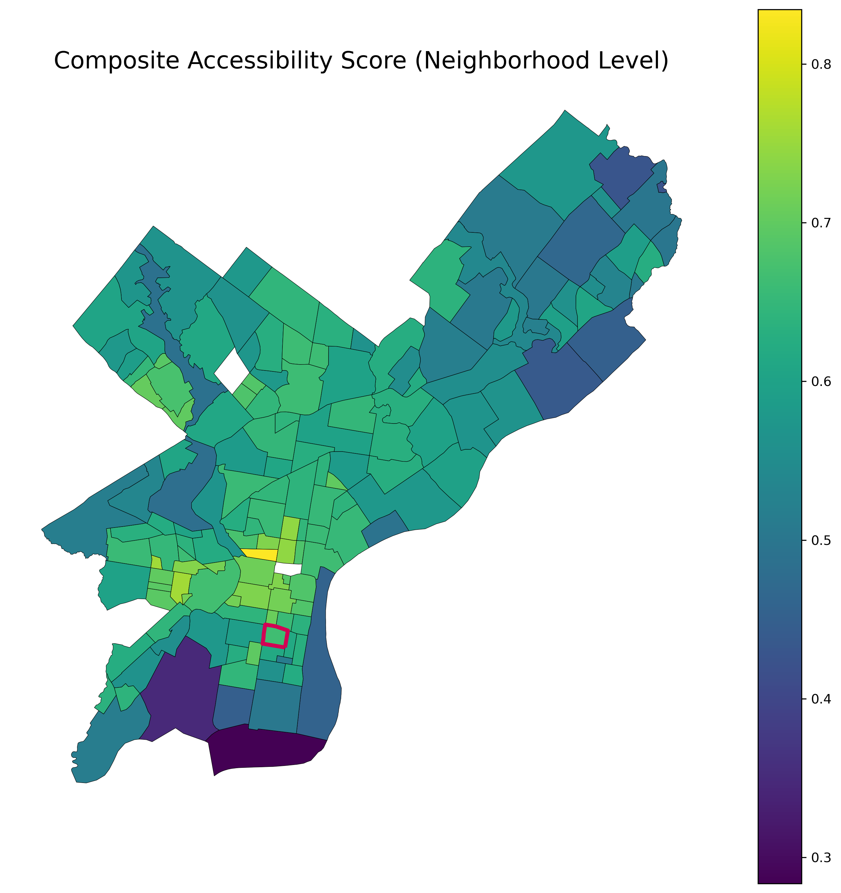
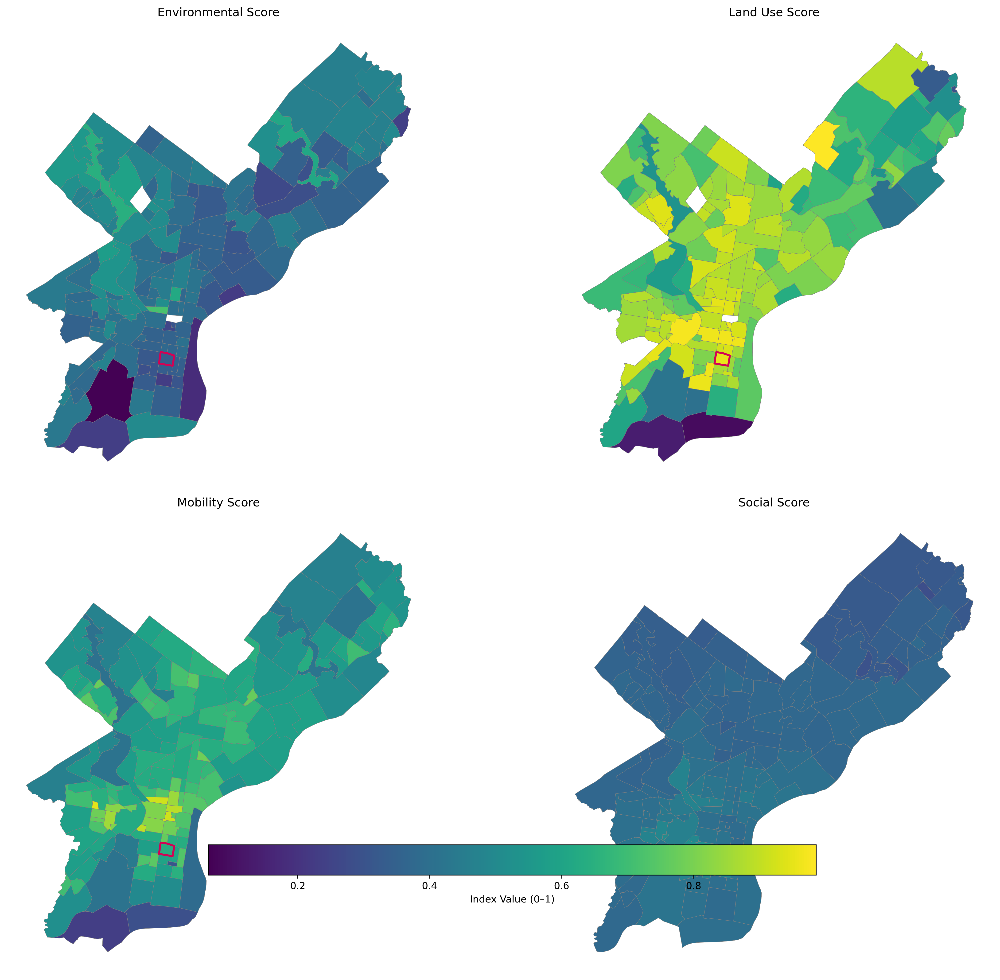
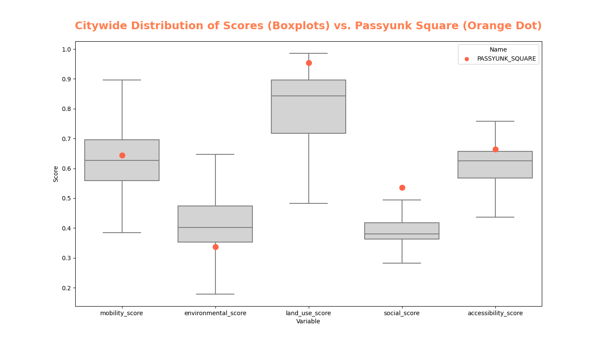
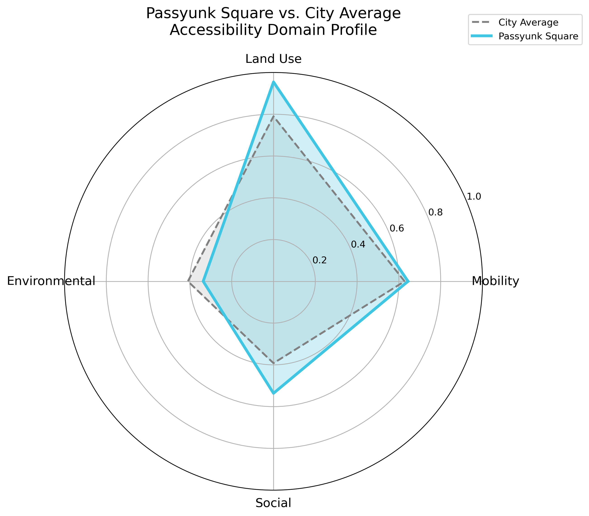

# Accessibility Score

The Accessibility Score is the final composite indicator synthesizing four domains of neighborhood accessibility: **Environmental**, **Land Use**, **Mobility**, and **Social**. Each domain captures a different dimension of lived accessibility, and together they form a multidimensional representation of how supportive and navigable each Philadelphia neighborhood is for residents.

All four domain scores are normalized to a 0–1 scale and averaged equally to compute the final index.

---

## Data Sources

This composite score integrates outputs from the four analysis domains. The underlying data come from:

- **Remote sensing (Landsat 8 SR via GEE)** — vegetation and environmental quality  
- **OpenStreetMap (OSM)** — amenities, parks, green space  
- **Philadelphia Parks & Recreation** — additional green infrastructure  
- **DVRPC Pedestrian & Bicycle Network** — sidewalks and bike infrastructure  
- **Philadelphia Streets Department Curb Data** — cartways vs. non-cartways  
- **ACS 2022 5-year Estimates** — disability, age, and commuting  
- **OpenDataPhilly** — neighborhood boundaries  
- **Census Tracts** — spatial aggregation unit  

Each dataset is processed in domain-specific notebooks and aggregated to neighborhood-level values.

---

## Components of the Accessibility Score

### **1. Environmental Score**
Captures ecological and green-space quality through:
- NDVI (vegetation health)  
- Park proximity  
- Tree canopy coverage  

Detailed formulas appear in `environmental_score.md`.

---

### **2. Land Use & Amenity Score**
Captures access to daily needs through:
- Healthcare proximity  
- Service & retail accessibility  

See `land_use_score.md` for methods.

---

### **3. Mobility Score**
Captures walkability and multimodal mobility through:
- Sidewalk continuity  
- Bike lane density  
- Inverted cartway exposure  

Methods in `mobility_score.md`.

---

### **4. Social Score**
Captures population characteristics tied to vulnerability:
- Inverted disability rate  
- Inverted age 65+ rate  
- Walk-to-work rate  

Methods in `social_score.md`.

---

## Normalization & Weighting

All domain scores are on a comparable **0–1 scale**, where:

- **1 = Most accessible**  
- **0 = Least accessible**

Each domain is a weighted combination reflecting their relatve influence:

$$
\text{AccessibilityScore} =
\;
0.4 \cdot \class{eq-gold}{\text{MobilityScore}}
\;+\;
0.3 \cdot \class{eq-gold}{\text{LandUseScore}}
\;+\;
0.2 \cdot \class{eq-gold}{\text{EnvironmentalScore}}
\;+\;
0.1 \cdot \class{eq-gold}{\text{SocialScore}}
$$

Rationale for weights:
- **Mobility (40%)**: Directly impacts daily navigation and access to infrastructure.
- **Land Use (30%)**: Reflects proximity to essential services and amenities.
- **Environmental (20%)**: Supports overall wellbeing and quality of life.
- **Social (10%)**: Captures demographic vulnerabilities affecting accessibility.

---

## Maps

### **Composite Accessibility Map (Neighborhood Level)**  

This map visualizes Philadelphia neighborhoods on a single accessibility gradient, highlighting areas of strong multimodal access and daily-living support.

---

### **Domain Comparison Map Grid**

This grid allows viewers to compare the spatial structures of each contributing domain.

---

## Percentile Ranking

Neighborhood accessibility percentiles were calculated from the final composite distribution.

### **Passyunk Square Performance**

- Passyunk Square ranks **above the city median** in Environmental  
- **High** in Land Use & Amenity (dense corridor access)  
- **Above average** in Mobility (sidewalk strength, moderate bike access)  
- **Strong** Social Score (low disability rate, high walk-to-work)  
- Composite percentile: **≈ top quartile citywide**

### Radar Chart: Passyunk Square vs. City Average

---

## Interpretation

The Accessibility Score reveals several key findings:

### **1. Center City and adjacent neighborhoods form the strongest cluster.**  
High walkability, dense transit, rich service access, and strong canopy coverage elevate their composite scores.

### **2. Northwest Philadelphia performs well environmentally and socially but has uneven mobility.**

### **3. River Wards show high walk-to-work rates but weaker environmental characteristics.**

### **4. Far Northeast and Southwest tend to rank lowest**, largely due to:

- Lower amenity density  
- Sparse sidewalk networks  
- Limited transit-adjacent land use  
- Older populations in some areas  

---

## Passyunk Square Discussion

Passyunk Square stands out due to:

- **Amenity-rich land use** (restaurant row + health services)  
- **Strong mobility performance**, especially sidewalks  
- **Favorable social indicators** supporting local mobility  
- **Moderate environmental quality**, but improved by access to private and pocket green spaces  

Together, these raise Passyunk Square into one of the most accessible mixed-use neighborhoods outside Center City.

---

## Conclusion

The Accessibility Score provides a unified, multidimensional understanding of how neighborhoods support daily life, mobility, and wellbeing. It bridges urban form, environmental quality, infrastructure, and demographic factors into a single interpretable measure—essential for planning, equity analysis, and mapping lived experience across Philadelphia.

