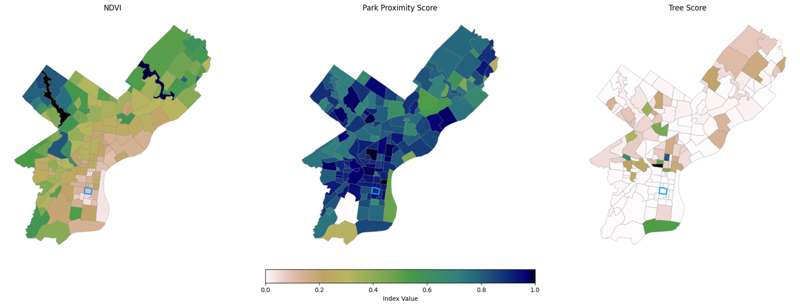

# Environmental Score

The Environmental Score evaluates ecological and physical environmental quality in Philadelphia neighborhoods.  
It uses three equally weighted indicators calculated at the census-tract level and then aggregated to neighborhoods:

1. Vegetation Health (NDVI)  
2. Proximity to Parks & Green Space  
3. Urban Tree Canopy Coverage  

All indicators are normalized to a 0–1 scale, where higher values represent more favorable environmental conditions.

---

## Indicators

### **1. Vegetation Health (NDVI)**  
Calculated from Landsat 8 Surface Reflectance imagery:

\[
\text{NDVI} = \frac{(\text{NIR} - \text{Red})}{(\text{NIR} + \text{Red})}
\]

Min–Max normalization:

\[
\text{NDVIScore} =
\frac{\text{NDVI}_{\text{tract}} - \text{NDVI}_{\min}}
     {\text{NDVI}_{\max} - \text{NDVI}_{\min}}
\]

---

### **2. Proximity to Parks**
Distances from tract centroids to nearest park are computed using a KD-Tree.

\[
\text{ProximityScore} =
1 -
\frac{d_{\text{tract}} - d_{\min}}
     {d_{\max} - d_{\min}}
\]

---

### **3. Urban Tree Canopy**

Tree canopy coverage is estimated using PPR’s 2015 tree canopy points.  
Tree density is calculated per tract as:

\[
\text{TreeDensity} =
\frac{\text{TreeArea}}{\text{TractArea}}
\]

and normalized as:

\[
\text{TreeScore} =
\frac{
\text{TreeDensity}_{\text{tract}} - \text{Density}_{\min}
}{
\text{Density}_{\max} - \text{Density}_{\min}
}
\]

---

## **Composite Environmental Score**

The final environmental domain score is the equal-weighted average of NDVI, park proximity, and tree canopy:

\[
\text{EnvironmentalScore} =
\frac{
\text{NDVIScore}
+
\text{ProximityScore}
+
\text{TreeScore}
}{3}
\]

Neighborhood values are computed by averaging tract-level environmental scores within each neighborhood boundary.

---

## **Visualizations**

### **Neighborhood Environmental Score Map**

**NDVI:** Passyunk Square ranks low on the citywide NDVI distribution, indicating limited vegetation health relative to other neighborhoods.  
**Proximity to Parks:** The neighborhood has moderate access to parks, with several reachable on foot but fewer large green spaces nearby.  
**Tree Canopy:** Tree coverage is sparse in Passyunk Square, lowering its overall environmental domain score.

