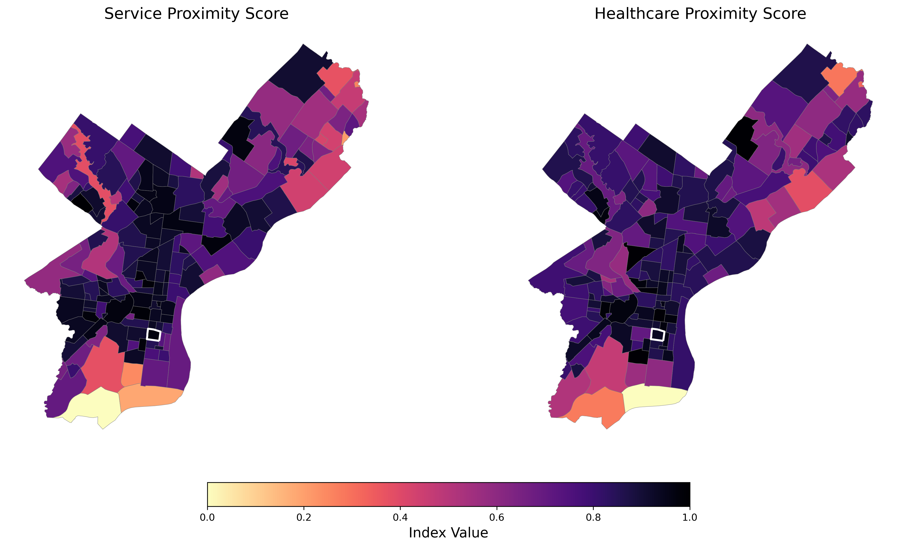
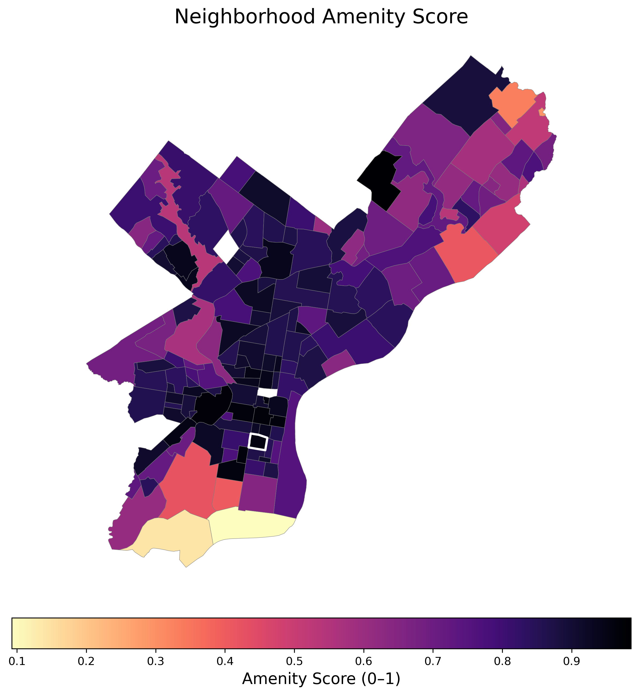
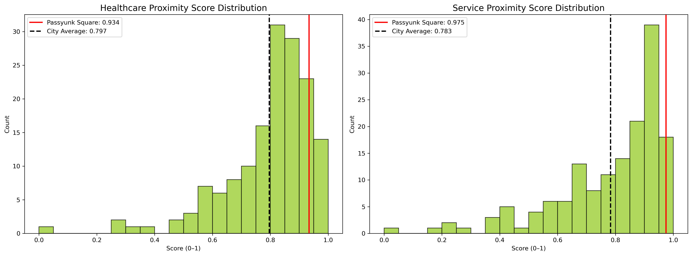

# Land Use/Health & Service Proximity Score

## Overview

The Land Use & Health Service Score measures neighborhood access to key public health and social services built from two tract-level indicators:

1. **Proximity to Health Services**
2. **Porximity to Social Services & Civic Amenities**

Each indicator is computed using distance-to-nearest facility, normalized to a 0–1 scale, and averaged to produce a final amenity score per neighborhood.
Higher scores indicate better spatial access to essential services.

---

# Data Sources

- Health Services: OSMnx points of interest with tags:
  ```python
  health = {'healthcare':['hospital','clinic','pharmacy','dentist', 'emergency', 'nursing_home']}
  ```
- Social Services: OSMnx points of interest with tags:
  ```python
  service = {'amenity':['post_office','library','police','social_facility','fire_station','childcare']}
  ```

- Neighborhood Boundaries: Philadelphia neighborhood shapefile from OpenDataPhilly.
- Census Tracts: 2021 Census tract shapefiles for spatial joins.

---

# Methodology

1. **Extracting Healthcare & Amenity Locations**

   Using OSMnx, we queried and extracted point locations for health services and social amenities across Philadelphia.
   ```python
   service = ox.features_from_polygon(
    gdf.unary_union,
    tags={'amenity': ['post_office', 'social_facility','fire_station', 'library', 'police', 'childcare']})

    health = ox.features_from_polygon(
    gdfhealth.unary_union,
    tags={'healthcare': ['hospital', 'pharmacy','clinic', 'dentist', 'emergency', 'nursing_home']})
    ```

---

2. **Nearest Facility Distance Calculation**  

    All facility coordinates were converted to `shapely` Point geometries.
    A KDTree spatial index was built for efficient nearest-neighbor queries.
    For each neighborhood centroid, we computed the Euclidean distance to the nearest health service and social amenity.

    FORMULA: di​=jmin​(∥xi​−yj​∥)
    Where:
    - xi = neighborhood centroid
    - yi = facility location
    - di = distance to nearest facility

---

3. **Normalizing Distances to Scores**

   Distances were min-max normalized to a 0–1 scale, inverted so that shorter distances yield higher scores:
   ```python
   normalized_score = 1 - (distance - min_distance) / (max_distance - min_distance)
   ```

   Higher scores = closer to facilities.

   Done for both Health and Social Services distances.

---

4. **Composite Land Use & Health Score**

    The final Land Use & Health Score per neighborhood is the average of the two normalized scores:
    ```python
    land_use_health_scorei = (health_proximity_scorei + service_proximity_scorei) / 2
    ```
    This composite score reflects overall access to essential health and social services.

    ---

5. **Intergation into Neighborhood Accessibility Index**

   Proximity scores were merged into the main neighborhood GeoDataFrame for further analysis and visualization as part of the overall accessibility index.

---

# Interpretation 

## Visualizations

1. **Neighborhood-Level Amenity Proximity Maps**  
   
   Choropleth maps showing spatial distribution of Health Service and Social Service proximity scores across Philadelphia neighborhoods.
   
   

2. **Health & Social Combined**

    Map of the combined Land Use & Health Score highlighting neighborhoods with best access to services.
    
    

3. Histograms of Score Distributions

   Histograms displaying the distribution of Health Service and Social Service proximity scores across neighborhoods.
   
   

---

## Key Findings

East Passyunk has a breadth of social and health services immediately accessible to most residents. It is ever so slightly above average than the rest of the city, especially compared to North Philly that has several pink and purple pockets in the health proximity score. The land use score is Easy Passyunk's strongest accessibility variable. 
