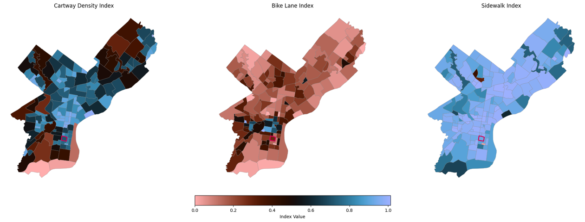

# Mobility Score Documentation

## Overview 
The Mobility Score evaluates neighborhood access to transportation infrastructure and options, built from three neighborhood-level indicators:

1. **Bike Lane Density** (higher = more bike-accessible streets)  
2. **Sidewalk Continuity** (higher = more pedestrian-friendly streets)  
3. **Curb–Cartway Density (Inverted)** (lower = fewer curb cuts, better pedestrian safety)

Each component is normalized to a **0–1 scale** and averaged to produce the final Mobility Score.

---

## Data Sources

### **OpenDataPhilly**
- Curbs dataset  
- Cartways dataset  
- Bike Network dataset  

### **Census Tracts 2021**
Used for spatial joins and tract-level aggregation.

### **OSMnx Street Network**
Used to extract sidewalk/footway geometries:

```python
philly = ox.geocode_to_gdf("Philadelphia, PA")
```

and Amenities example:

```python
amenities = ox.features_from_place("Philadelphia, PA", tags={"amenity": True})
```

---
## Methodology

1. ### **Bike Lane Density Index**

   From OpenData Philly's Bike Network dataset, we calculated the total length of bike lanes within tracts boundary using spatial joins. Then we aggregated to neighborhood level and computed bike lane density as:
   
   ```python
   Bike Lane Density = (total bikelane length) / (neighborhood area)
    ``` 
   Normalized to 0–1 scale.

   ---

2. ### **Sidewalk Continuity Index**

    Sidewalk networks were extracted from OSMnx street network data and combined with OpenDataPhilly sidewalk data. We calculated total sidewalk length per tract, aggregated to neighborhood level, and computed sidewalk density as:

    ```python
    Sidewalk Density = 1 - (# of sidewalk gaps) / (total sidewalks)
    ```
    Normalized to 0–1 scale.

    ---

3. ### **Curb-Cartway Density Index (Inverted)**
    
    Using OpenDataPhilly's Curb and Cartway datasets, we calculated total curb cuts per tract, aggregated to neighborhood level, and computed curb-cartway density as:

    ```python
    Curb-Cartway Density = (total curb cuts) / (neighborhood area)
    ```

    This measure was inverted (1 - normalized value) so that lower curb density yields a higher score, indicating better pedestrian safety.

    ---

4. ### **Composite Mobility Score Calculation**

    Finally, we averaged the three normalized indices to compute the overall Mobility Score for each neighborhood:

    ```python
    Mobility Score = (Bike Lane Density + Sidewalk Continuity + Inverted Curb-Cartway Density) / 3
    ```

---

## Visualizations 

Maps and histograms were created to visualize the spatial distribution of the Mobility Score and its components across Philadelphia neighborhoods.

### Mobiltiy Component Maps 

A three panel map visualizaes the spatial distribution of each mobility component:

 

*** Curb-Cartway Density***: Higher curb cut density (bluer areas) indicates lower pedestrian safety due to higher arterials and commerical corridors.The Southern part of the city may be an error stemming from incomplete curb data and lack of sidewalks in industrial zones (like the Navy Yard)

*** Bike Lane Index***: Higher bike lane density (bluer areas) indicates better bike infrastructure. Center City and University City have the highest bike lane density, while large swaths of North and West Philadelphia have lower bike lane coverage. This should be corroborated with Indego usage data.

*** Sidewalk Continuity***: Higher sidewalk continuity (bluer areas) indicates more pedestrian-friendly streets. Most neighborhoods have high sidewalk continuity, except for some industrial areas and parks.


