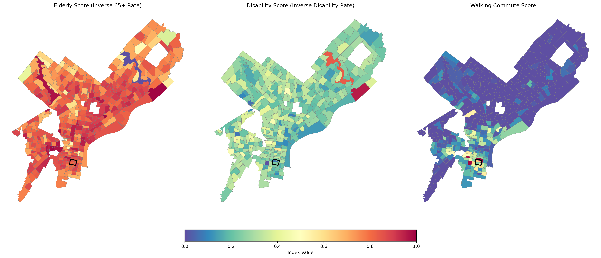
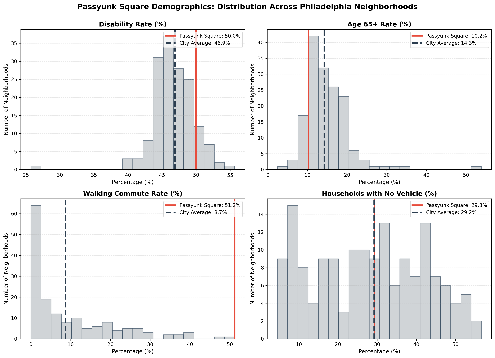
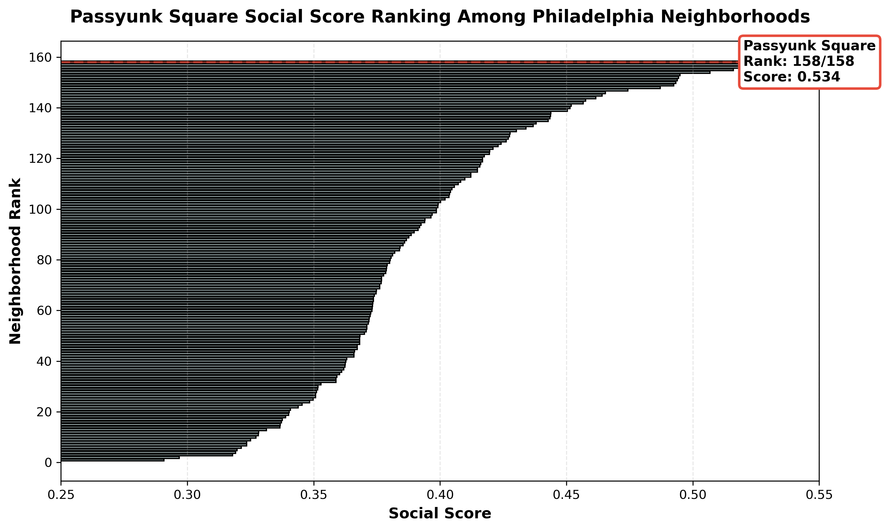

# Social Score

The Social Score measures neighborhood-level social conditions that influence accessibility needs in Philadelphia.  
It is built from American Community Survey (ACS) demographic variables and captures population characteristics related to mobility vulnerability.

The score is calculated at the **census tract level** and then aggregated to **neighborhood boundaries** for citywide comparisons.

---

## Overview

The Social Score reflects three core demographic components:

1. **Disability Score (inverted disability rate)**  
2. **Elderly Score (inverted age 65+ rate)**  
3. **Walker–Commuter Score (walking to work rate)**  

Each variable is transformed into a 0–1 scale and averaged:

\[
\text{Social Score} = \frac{
\text{disability\_rate\_inv} +
\text{age\_65\_plus\_rate\_inv} +
\text{commute\_walk\_rate}
}{3}
\]

High values indicate tracts with **lower demographic vulnerability** and **greater likelihood of population-based mobility independence**.

---

## Data Sources

All indicators originate from the **2021 ACS 5-year tables**:

### Disability  
- `B18101`, `B18101A–I`: Disability by race categories  
- `C18108`: Types of disability  

### Age 65+  
- `B01001`: Male and female age distributions (all 65+ bins)

### Commuting  
- `B08301`: Modes of transportation to work

### Vehicles per Household  
- `B08201`

(Additional variables are derived internally as rates or totals.)

Full code for renaming and cleaning variables is in the project notebook.

---

## Methodology

### 1. Preparing ACS Variables

All ACS raw counts are converted to numeric and cleaned.  
Key totals include:

- **total_population**
- **population_with_disability**
- **total_age_65_plus** (sum of all 65+ age bins)
- **commute_walk**, **total_workers**
- **households_no_vehicle**, **total_households**

---

### 2. Component Calculations

#### **a. Disability Rate**
\[
\text{disability\_rate} = \frac{\text{population\_with\_disability}}{\text{total\_population}}
\]

Because higher disability prevalence indicates higher vulnerability, we invert the measure:

\[
\text{disability\_rate\_inv} = 1 - \text{disability\_rate}
\]

---

#### **b. Elderly Rate (65+)**
\[
\text{age\_65\_plus\_rate} = \frac{\text{total\_age\_65\_plus}}{\text{total\_population}}
\]

Also inverted:

\[
\text{age\_65\_plus\_rate\_inv} = 1 - \text{age\_65\_plus\_rate}
\]

This inversion does *not* imply older residents are undesirable; rather, older residents often require more accessible infrastructure, so high elderly populations indicate **greater need**, hence lower Social Scores.

---

#### **c. Walking-to-Work Rate**
\[
\text{commute\_walk\_rate} =
\frac{\text{commute\_walk}}{\text{total\_workers}}
\]

Higher rates imply stronger pedestrian infrastructure and local-access travel behaviors.

---

## 3. Normalization

The three features are normalized with MinMax scaling:

```python
mobility_features = [
    "disability_rate_inv",
    "age_65_plus_rate_inv",
    "commute_walk_rate"
]

df[mobility_features] = scaler.fit_transform(df[mobility_features])
```
Text placeholder.

---

## 4. Final Social Score Calculation
The final Social Score is the average of the three normalized components:
\[
\text{Social Score} = \frac{    
\text{disability\_rate\_inv} +
\text{age\_65\_plus\_rate\_inv} +
\text{commute\_walk\_rate}
}{3}
\]
Higher Social Scores indicate neighborhoods with **lower social vulnerability** and **greater demographic mobility independence**.

-- 

## 5. Aggregation to Neighborhoods

The tract-level Social Scores are spatially joined to Philadelphia neighborhood boundaries from the philly_neighborhoods.geojson file.
Neighborhood-level scores are computed as the mean of constituent tracts:

```python
agg_vars = [
    "disability_rate",
    "age_65_plus_rate",
    "commute_walk_rate",
    "households_no_vehicle_rate", # not included in final score
    "mobility_index" # should be called social/demographic score
]
neigh_summary = tracts_to_hoods.groupby("NAME_right")[agg_vars].mean().reset_index()
neigh_summary = neigh_summary.rename(columns={"NAME_right": "Neighborhood"})
```

Passyunk Square's aggregated Social Score can then be compared to other neighborhoods in Philadelphia for accessibility analysis.

--- 

## Interpretation

High Social Scores reflect neighborhoods with demographics that typically experience fewer mobility barriers, such as lower disability prevalence, fewer elderly residents, and higher rates of walking to work. Conversely, low Social Scores highlight areas where residents may face greater challenges related to mobility independence, indicating potential needs for improved infrastructure and services.

### 1. Citywide Patterns

These maps show the spatial distribution of the three components used to build the Social Score across Philadelphia neighborhoods.

Passyunk Square is highlighted for reference.


***Elderly Score (Inverse 65+ Rate)***: Higher scores (greener areas) indicate lower proportions of elderly residents, suggesting potentially lower mobility vulnerability related to age.
*** Disability Score (Inverse Disability Rate)***: Higher scores (greener areas) indicate lower disability prevalence, suggesting potentially lower mobility vulnerability related to disability.
*** Walker-Commuter Score***: Higher scores (greener areas) indicate higher rates of walking to work, suggesting stronger pedestrian infrastructure and local-access travel behaviors.

---
### 2. Social Score Distribution

These histograms display the distribution of Social Scores across all Philadelphia neighborhoods, with Passyunk Square highlighted.



================================================================================
KEY FINDINGS
================================================================================
• Passyunk Square ranks 158 out of 158 neighborhoods
• Social Score: 0.534 (City Avg: 0.391)
• Percentile: 100.0th
================================================================================

---

### 3. Compare to City Average

Passyunk Square's Social Score of 0.534 is significantly higher than the city average of 0.391, placing it in the 100th percentile among Philadelphia neighborhoods. This indicates that Passyunk Square has a demographic profile associated with lower mobility vulnerability compared to other areas in the city.


!

---

