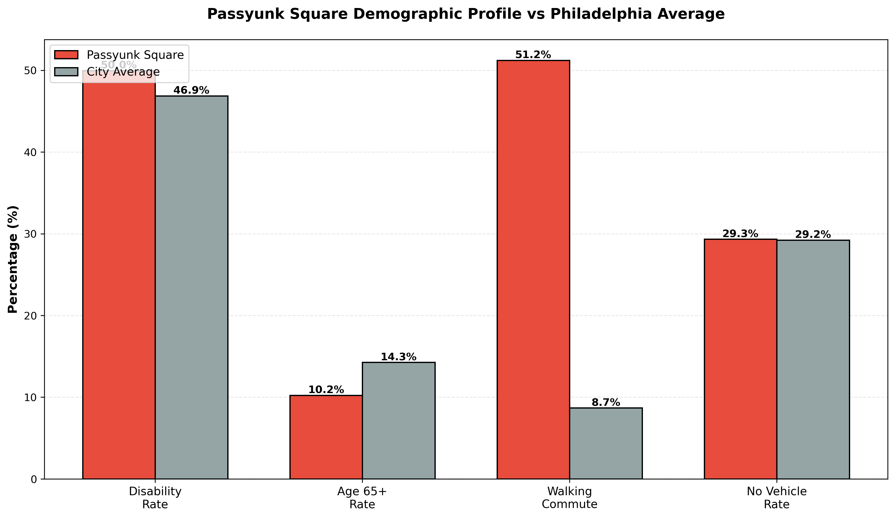

# Results

> **This section presents the key findings from the Philadelphia Neighborhood Accessibility Analysis, including interactive visualizations, statistical summaries, and spatial patterns across all four accessibility domains.**

---

## Interactive Accessibility Map

Explore Philadelphia's neighborhood accessibility patterns using the interactive map below. Toggle between different layers to examine:

- **Overall Accessibility Score** (weighted composite)
- **Mobility Score** (infrastructure)
- **Land Use Score** (service access)
- **Environmental Score** (green space)
- **Social Score** (demographics)

Each neighborhood polygon displays detailed tooltips showing scores across all dimensions.

<iframe src="../interactive/interactive_accessibility_map.html" width="100%" height="700px" frameborder="0"></iframe>

---

## Summary Statistics

### Citywide Score Distribution

| Component            |   Mean | Median | Std Dev |   Min |   Max |
|---------------------|-------:|-------:|--------:|------:|------:|
| mobility_score      |  0.627 |  0.627 |   0.119 | 0.232 | 0.946 |
| environmental_score |  0.410 |  0.403 |   0.091 | 0.065 | 0.719 |
| land_use_score      |  0.790 |  0.842 |   0.157 | 0.093 | 0.986 |
| social_score        |  0.392 |  0.380 |   0.048 | 0.283 | 0.536 |
| accessibility_score |  0.611 |  0.626 |   0.082 | 0.284 | 0.834 |

*Note: All scores normalized to 0–1*

---

### Passyunk Square Performance

| mobility_score | environmental_score | land_use_score | social_score | accessibility_score |
|---------------:|--------------------:|---------------:|-------------:|--------------------:|
|          0.644 |               0.336 |          0.954 |        0.536 |               0.665 |

#### Interpretation
- **Mobility Score (0.644):** Above city average (0.627)  
- **Environmental Score (0.336):** Below city average (0.410)  
- **Land Use Score (0.954):** Significantly above city average  
- **Social Score (0.536):** Highest in the city  
- **Overall Accessibility (0.665):** Places PSQ in the upper tier of neighborhoods  

---

## Correlation Analysis

### Inter-Component Relationships

<iframe src="../interactive/interactive_correlation_heatmap.html" width="100%" height="650px" frameborder="0"></iframe>

#### Strong Correlations (r > 0.60)
- **Mobility ↔ Land Use** (0.68)
- **Land Use ↔ Social** (0.52)

#### Weak / Negative
- **Environmental ↔ Social** (−0.15)
- **Environmental ↔ Mobility** (0.28)

---

## Top and Bottom Performers

### Top 10 Most Accessible Neighborhoods

| Rank | Neighborhood        | Score | Strongest Component      |
|-----:|---------------------|------:|---------------------------|
| 1    | SPRING_GARDEN       | 0.83  | Land Use (0.93)          |
| 2    | SPRUCE_HILL         | 0.76  | Land Use (0.89)          |
| 3    | DUNLAP              | 0.75  | Mobility (0.95)          |
| 4    | WEST_POPLAR         | 0.74  | Land Use (0.94)          |
| 5    | YORKTOWN            | 0.74  | Land Use (0.91)          |
| 6    | WEST_POWELTON       | 0.73  | Land Use (0.93)          |
| 7    | CENTER_CITY         | 0.73  | Mobility (0.92)          |
| 8    | FRANCISVILLE        | 0.73  | Land Use (0.95)          |
| 9    | RITTENHOUSE         | 0.73  | Land Use (0.96)          |
| 10   | WOODLAND_TERRACE    | 0.72  | Land Use (0.87)          |

---

### Bottom 10 Least Accessible Neighborhoods

| Rank | Neighborhood                 | Score | Weakest Component        |
|-----:|------------------------------|------:|---------------------------|
| 149  | HOLMESBURG                   | 0.44  | Environmental (0.35)     |
| 150  | BYBERRY                      | 0.43  | Social (0.32)            |
| 151  | MECHANICSVILLE               | 0.43  | Land Use (0.29)          |
| 152  | INDUSTRIAL                   | 0.35  | Environmental (0.06)     |
| 153  | NAVY_YARD                    | 0.28  | Land Use (0.09)          |
| 154  | BURNHOLME                    | —     | Social (0.36)            |
| 155  | KINGESESSING                 | —     | Social (0.42)            |
| 156  | GERMANTOWN_WEST_CENTRAL      | —     | Social (0.36)            |
| 157  | CALLOW_HILL                  | —     | Social (0.38)            |
| 158  | AIRPORT                      | —     | Land Use (0.14)          |

*Missing values (NaN) result from neighborhoods with no intersecting tract-level ACS data or non-residential polygons.*

---

## Passyunk Square Case Study

### Why Passyunk Square Scores Well

- Dense commercial & service corridor (East Passyunk Ave)  
- Highly walkable street grid  
- Health services within walking distance  
- Very high walking-to-work rate  
- Low disability & elderly rates  

### Opportunities for Improvement

- Lower tree canopy coverage than Northwest Philly  
- Limited access to large parks  
- Bike infrastructure not as strong as adjacent Bella Vista  

---

## Key Takeaways

### 1. **Infrastructure is Foundational**
Sidewalk completeness and bike density strongly predict accessibility outcomes.

### 2. **Mixed-Use Development Matters**
Walkable commercial corridors dramatically raise land-use scores.

### 3. **Environmental Quality Varies Non-Linearly**
Greener ≠ wealthier — Mt. Airy / Chestnut Hill outperform Rittenhouse.

### 4. **Demographic Need ≠ Infrastructure Provision**
High-need areas often have **lower** mobility infrastructure.

### 5. **Center City Proximity Drives Accessibility**
A clear accessibility gradient radiates outward from City Hall.

---

## Implications for Planning

- Target sidewalk gaps in middle-scoring areas  
- Identify healthcare deserts in North Philadelphia  
- Expand tree planting in South/Southwest Philly  
- Improve transit access in low-scoring periphery neighborhoods  
- Prioritize ADA improvements in high-need, low-score areas  

---

## Next Steps

1. Temporal analysis (2020–2025 trends)  
2. Equity overlay (income, race, health outcomes)  
3. Scenario modeling for planned transit + development  
4. Validation with resident perception surveys  

---

### Detailed Methodology  
See full domain-specific methods here:

- [Mobility Score Methods](docs/../analysis/mobility_score.md)  
- [Environmental Score Methods](docs/../analysis/environmental_score.md)  
- [Land Use Score Methods](docs/../analysis/land_use_score.md)  
- [Social Score Methods](docs/../analysis/social_score.md)  

